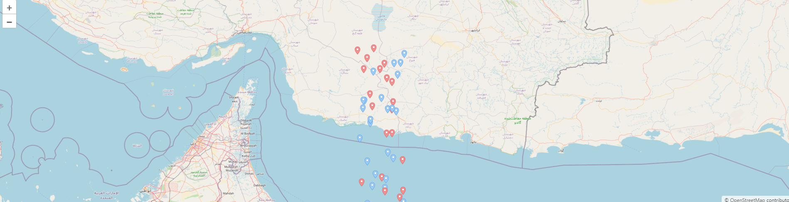
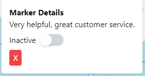
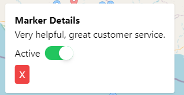

React + TypeScript + Vite Map Application
This project is a minimal setup for building a map application using React, TypeScript, and Vite. The application features an interactive map displaying markers with toggling status functionality, and it is optimized for offline use with service workers.

Features
React for building user interfaces
TypeScript for type safety
Vite for fast development and HMR (Hot Module Replacement)
OpenLayers for mapping functionality
PWA (Progressive Web App) support for offline access
Installation
To get started with this project, follow these steps:

Clone the repository:

bash
Copy code
git clone https://github.com/your-username/react-typescript-vite-map-app.git
cd react-typescript-vite-map-app
Install dependencies:

bash
Copy code
npm install
Run the development server:

bash
Copy code
npm run dev
Open your browser and navigate to http://localhost:3000.

Usage
Markers
The application displays markers on a map that can be toggled on or off. Click on a marker to view its details and change its status using the toggle switch.

Offline Mode
This application uses service workers to provide offline capabilities. When offline, the app will display cached content.

For mobile phone (PWA) 

Configuration
ESLint
This project uses ESLint for code quality. To configure ESLint for TypeScript, ensure your .eslintrc.js file includes:

javascript
Copy code
export default tseslint.config({
  languageOptions: {
    parserOptions: {
      project: ['./tsconfig.node.json', './tsconfig.app.json'],
      tsconfigRootDir: import.meta.dirname,
    },
  },
  settings: { react: { version: 'detect' } },
  plugins: {
    react: require('eslint-plugin-react'),
  },
  rules: {
    ...react.configs.recommended.rules,
    ...react.configs['jsx-runtime'].rules,
  },
});